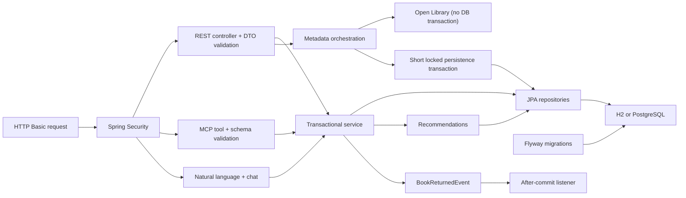

# Roadmap and implementation approach

## 1. Scope and assumptions

The exercise prioritizes backend fundamentals and code structure rather than a
large feature set. The implementation therefore keeps the first release small:

- one library inventory
- copy counts per book rather than individually barcoded physical copies
- authenticated owner and client accounts
- a configurable loan duration supplied as 1 to 60 days
- no renewals in the first release
- removal means deactivation, not destruction of historical data

## 2. Architecture



The package layout is feature-first (`book`, `loan`, `user`) with shared
configuration and error handling kept separate. Controllers own HTTP concerns,
services own use cases and transaction boundaries, entities protect local
invariants, and repositories own persistence access.

## 3. Delivery phases

### Phase 1 - Required foundation (implemented)

- Maven project targeting Java 25
- Spring Boot, Spring MVC, JPA, validation, and security
- Flyway schema and deterministic demo data
- searchable, paginated inventory
- owner-only add, update, and remove operations
- client borrow and return operations
- client and owner history views
- late-return tracking
- consistent validation and problem-detail responses

Completion signal: the application starts from IntelliJ with no external
services and all required workflows are callable through REST.

### Phase 2 - Correctness and confidence (implemented)

- pessimistic locking around copy-count changes
- soft deletion to preserve referential and historical integrity
- unit tests for inventory invariants
- H2-backed end-to-end API and authorization tests
- PostgreSQL Testcontainers migration test
- JaCoCo HTML/XML reports with enforced 100% line and branch coverage
- SonarQube Community Build analysis with a dedicated PostgreSQL container
- validated OpenAPI contract for all REST operations
- configurable late-fee policy with atomic registration and owner settlement
- FIFO reservation queues with expiring, protected copy allocations
- after-commit return event
- Docker Compose PostgreSQL environment
- authenticated Spring AI MCP server with 21 permission-checked tools
- natural-language catalog search and a grounded, read-only assistant API
- explainable recommendation ranking with cold-start behavior
- persisted, versioned Open Library metadata enrichment

Completion signal: `mvn verify` succeeds, PostgreSQL verification runs whenever
Docker is available, and the SonarQube quality gate passes.

### Phase 3 - Production hardening (recommended next)

1. Replace HTTP Basic with an external OAuth2/OIDC identity provider and JWTs.
2. Remove seeded users from the production migration and add a controlled
   provisioning workflow.
3. Add idempotency keys to borrow and return commands.
4. Add audit records for owner inventory changes.
5. Add actuator health, metrics, tracing, and structured logs.
6. Add rate limiting, production secrets management, and TLS termination.
7. Add concurrency and load tests for the last-copy borrowing scenario.
8. Generate and publish a client SDK from the existing OpenAPI contract.

Completion signal: the service can be deployed securely, observed, and operated
without relying on demo credentials or in-memory infrastructure.

### Phase 4 - Optional library workflows

1. **Renewals:** permit renewal only when no reservation is waiting.
2. **Physical copies:** split `Book` metadata from individually tracked
   `BookCopy` records when barcode-level inventory becomes necessary.

Completion signal: queue position, fee calculations, and copy-level state are
deterministic and covered by integration tests.

### Phase 5 - Search and AI extensions

1. **Implemented:** expose carefully scoped read and command tools through a
   stateless, authenticated MCP server.
2. **Implemented:** parse English and Portuguese catalog questions into explicit
   search text and a tri-state availability filter.
3. **Implemented:** rank recommendations using only the authenticated client's
   history, enriched subjects, aggregate popularity, and inventory availability.
4. **Implemented:** enrich and persist supplemental metadata from the trusted
   Open Library ISBN search API without overwriting owner-managed fields.
5. **Implemented:** expose a read-only, role-aware chat assistant that returns
   structured, database-grounded results and keeps mutations explicit.
6. **Future hardening:** move provider refreshes to an outbox-backed asynchronous
   worker and add PostgreSQL full-text/vector search when catalog size justifies it.

Completion signal: AI-facing capabilities reuse the same service-layer
authorization and cannot bypass business rules.

## 4. Data model

```text
LibraryUser 1 ----- * Loan             * ----- 1 Book
LibraryUser 1 ----- * BookReservation  * ----- 1 Book
Loan        1 ----- 0..1 LateFee
Book        1 ----- 0..1 BookMetadata

LibraryUser: username, password hash, display name, role, enabled
Book: ISBN, metadata, total copies, available copies, active, version
Loan: borrower, book, borrowed at, due at, returned at, returned late
BookReservation: client, book, FIFO time, status, ready expiry
LateFee: immutable calculation snapshot plus settlement audit fields
BookMetadata: publisher, year, subjects, cover/source URLs, enriched timestamp
```

The loan row is the historical record. Returning a book updates that row instead
of deleting it. Books are deactivated rather than deleted, so every historical
foreign key remains valid.

## 5. Key risk controls

| Risk | Control |
|---|---|
| Two users borrow the last copy | Pessimistic lock on the book row |
| Inventory count becomes inconsistent | Entity invariants and database checks |
| Owner removes a borrowed book | Reject removal while an active copy is out |
| History disappears after removal | Soft deletion |
| Client accesses another client's loan | Ownership check in the service |
| Schema drifts from entities | Flyway migrations plus Hibernate validation |
| Event is emitted for rolled-back return | After-commit transactional listener |
| External metadata corrupts catalog truth | Values are bounded and stored in a supplemental versioned table; core fields are never overwritten |
| Slow metadata provider holds database resources | Remote lookup runs before the short persistence transaction and has strict timeouts |
| ISBN changes during metadata lookup | Pessimistic lock plus ISBN recheck rejects the stale refresh with `409 Conflict` |
| Assistant invents or mutates data | Deterministic intent routing, structured live data, read-only chat boundary |
| Recommendation leaks another user | Username always comes from the authenticated security context |

## 6. Suggested review order

1. `V1__create_library_schema.sql` for the data model.
2. `BookService` and `LoanService` for business use cases.
3. `SecurityConfig` for authentication and role mapping.
4. `BookController` and `LoanController` for the REST contract.
5. `LibraryApiIntegrationTest` for executable behavior examples.
6. `PostgresContainerIntegrationTest` for database portability.
